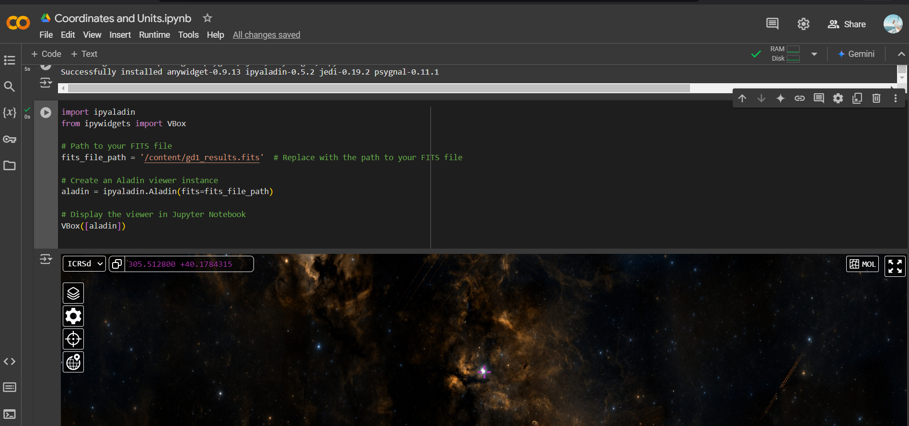

## Task: Cone Search and GD-1 Vicinity

This notebook starts with an example that performs a **cone search**, selecting stars that appear in a circular region of the sky.

To select stars in the vicinity of GD-1, we:

1. **Use Quantity Objects**
   - Represent measurements with units using Quantity objects.

2. **Coordinate Conversion**
   - Utilize the Gala library to convert coordinates from one frame to another.

3. **ADQL Keywords**
   - Leverage ADQL keywords like `POLYGON`, `CONTAINS`, and `POINT` to select stars within a polygonal region.

4. **Query Submission**
   - Submit a query and download the results.

5. **Store Results**
   - Save the results in a FITS file for further analysis.
